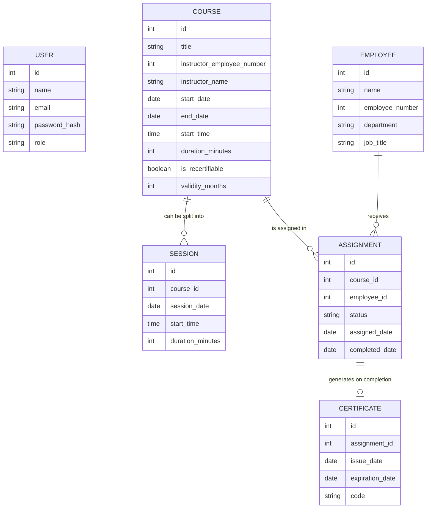

# CapacitaPro — Requirements Document

**Full-stack learning project — Phase 1: Requirements gathering and design**
**Author:** Uriel · **Date:** September 2026

---

## 1. Context and purpose

CapacitaPro is a web platform for managing employee training: which courses exist, who is required to take them, who has completed them, and when they expire.

The project is inspired by a real system the author built three years ago as a systems intern at a factory, using Excel and .NET. The goal of this version isn't just to replicate it, but to rebuild it with a modern architecture and an educational purpose: to serve as a vehicle for learning TypeScript, a custom backend with authentication, relational databases, testing, and container-based deployment.

## 2. Scope of version 1 (v1)

**In scope:**
- Employee management (manual entry and initial bulk upload from a file, and CSV export)
- Training course management (with instructor, dates, duration, and the ability to split into sessions)
- Manual assignment of courses to employees by HR/Admin
- Completion tracking with automatic certificate generation
- Validity control: some courses expire (recertification), others are one-time
- In-app notifications (dashboard) for assignments and upcoming expirations
- Compliance report by department/role, exportable to Excel/PDF
- Custom authentication (registration, login, JWT, role-based access control)

**Out of scope for v1** (documented so it isn't lost, not to be built):
- Password recovery, email verification, Google/OAuth login
- Detailed per-session attendance tracking within a multi-session course
- Email notifications
- Evidence approval (photos/files) to mark a course as completed
- Area Supervisor role or free self-enrollment by the employee

## 3. User roles

| Role | Description | Main capabilities |
|---|---|---|
| **Admin** | Administers the system | Employee onboarding, course creation, training assignment, sees all reports |
| **Instructor/HR** | Manages trainings | Course creation, training assignment, completion tracking, sees reports |
| **Employee** | End user (implicit, no login role in v1 — their data is managed, they don't log in) | — |

> Design note: in v1 only Admin and Instructor/HR have accounts with login. The employee is an entity managed by them, not a system user. This simplifies authentication without sacrificing the learning goal (we still need roles and access control between Admin and Instructor/HR).

## 4. User stories

1. As an Admin, I want to onboard employees manually or via file upload, so I don't waste time registering them one by one when I have a large list.
2. As an Instructor/HR, I want to create a training course with instructor, dates, and duration, so I have a catalog of available courses.
3. As an Instructor/HR, I want to manually assign a course to one or more employees, so I can control exactly who must take what.
4. As an Instructor/HR, I want to mark that an employee completed a course, so their certificate is generated automatically.
5. As an Instructor/HR, I want the system to flag when a recertifiable training expires, so I know who needs to be reassigned.
6. As an Admin, I want to see a compliance report by department or role, so I know what percentage of my staff is up to date.
7. As an Admin, I want to export that report to Excel or PDF, so I can share it or file it as evidence.
8. As an Admin or Instructor/HR, I want to see dashboard alerts for trainings about to expire or recently assigned, so I don't have to manually check each case.
9. As an Admin or Instructor/HR, I want to log in with my account and have the system respect my role, so only I (not just anyone) can perform certain actions.

## 5. Data model (first version)

**Design notes on the model:**

- **User** is distinct from **Employee**: User is whoever has an account and logs in (Admin, Instructor/HR); Employee is who trainings are assigned to and doesn't log in in v1. They are deliberately separate entities.
- **Course** vs. **Session**: a course can have several sessions (dates/parts), but in v1 attendance isn't tracked per individual session — the session exists so the course calendar can be shown, not for granular attendance.
- **Assignment** is the join table between Course and Employee (many-to-many relationship): a course has many assigned employees, an employee can have many assignments.
- **Certificate** depends on a completed Assignment: no certificate exists without an assignment that reached "completed" status.
- Department and job title live on Employee as plain text in v1; if an employee's department/job title changes, it's updated directly on their record (documented as a deliberate simplification — a future version could keep a change history).

## 6. Architecture decisions already made

- **Custom authentication** (not Supabase/Firebase/Auth0): registration, login with password hashing, JWT, role-verification middleware. No password recovery, email verification, or OAuth in v1.
- **Relational database** (specific engine to be decided during project setup — PostgreSQL is the default candidate given the model's multiple relationships).
- **Notifications**: in-app dashboard only, no email.
- **Report export**: to Excel and PDF, marked as a must-have.

## 7. Next steps

1. Set up the Git repository with a branching and pull-request workflow (Phase 0).
2. Translate this data model into an actual database schema (migrations).
3. Design the API endpoints based on the user stories in section 4.
4. Define basic wireframes for the main screens (dashboard, course catalog, assignment, reports).
