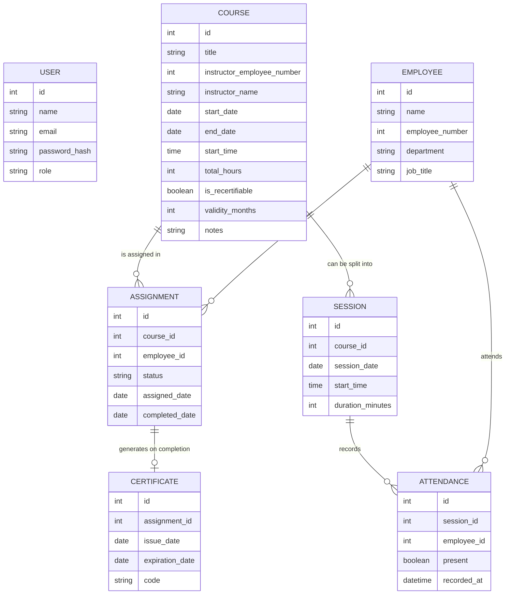

# CapacitaPro — Requirements Document

**Full-stack learning project — Phase 1: Requirements gathering and design**
**Author:** Uriel · **Date:** September 2026 · **Revision 2** (updated after wireframing)

---

## 1. Context and purpose

CapacitaPro is a web platform for managing employee training: which courses exist, who is required to take them, who has completed them, and when they expire.

The project is inspired by a real system the author built three years ago as a systems intern at a factory, using Excel and .NET. The goal of this version isn't just to replicate it, but to rebuild it with a modern architecture and an educational purpose: to serve as a vehicle for learning TypeScript, a custom backend with authentication, relational databases, testing, and container-based deployment.

## 2. Scope of version 1 (v1)

**In scope:**
- Employee management (manual entry and initial bulk upload from a file, basic search, and CSV export)
- Training course management (with instructor, dates, duration, total hours, notes, and the ability to split into sessions)
- Manual assignment of courses to employees by HR/Admin, with duplicate-assignment prevention
- **Digital attendance tracking per session**, taken live by the instructor from a phone/tablet
- Completion tracking, computed automatically once an employee has attended every session of a course, with automatic certificate generation
- Validity control: some courses expire (recertification), others are one-time
- In-app notifications (dashboard) for assignments and upcoming expirations
- Compliance report by department/role, exportable to Excel/PDF
- **Annual training hours report**, at factory-wide and department levels, exportable to Excel/PDF
- Custom authentication (registration, login, JWT, role-based access control)

**Out of scope for v1** (documented so it isn't lost, not to be built):
- Password recovery, email verification, Google/OAuth login
- Digital signature capture (the instructor's authenticated session is treated as sufficient evidence of attendance, replacing the physical sign-off used on paper)
- Annual hours report broken down per individual employee (only factory-wide and department levels are in scope)
- Email notifications
- Evidence approval (photos/files) to mark a course as completed
- Area Supervisor role or free self-enrollment by the employee

## 3. User roles

| Role | Description | Main capabilities |
|---|---|---|
| **Admin** | Administers the system | Employee onboarding, course creation, training assignment, sees all reports |
| **Instructor/HR** | Manages trainings | Course creation, training assignment, takes attendance, sees reports |
| **Employee** | End user (implicit, no login role in v1 — their data is managed, they don't log in) | — |

> Design note: in v1 only Admin and Instructor/HR have accounts with login. The employee is an entity managed by them, not a system user. This simplifies authentication without sacrificing the learning goal (we still need roles and access control between Admin and Instructor/HR).

## 4. User stories

1. As an Admin, I want to onboard employees manually or via file upload, so I don't waste time registering them one by one when I have a large list.
2. As an Instructor/HR, I want to create a training course with instructor, dates, duration, and total hours, so I have a catalog of available courses.
3. As an Instructor/HR, I want to manually assign a course to one or more employees, so I can control exactly who must take what, without accidentally assigning someone twice.
4. **As an Instructor, I want to take attendance for each session from my phone, marking each employee present or absent, so completion is tracked accurately without paper.**
5. As an Instructor/HR, I want a course to be automatically marked complete once an employee has attended every session, so I don't have to track it manually, and so the certificate is generated automatically.
6. As an Instructor/HR, I want the system to flag when a recertifiable training expires, so I know who needs to be reassigned.
7. As an Admin, I want to see a compliance report by department or role, so I know what percentage of my staff is up to date.
8. **As an Admin, I want to see total training hours delivered during the year, both factory-wide and broken down by department, so I can meet the factory's annual reporting requirements.**
9. As an Admin, I want to export reports to Excel or PDF, so I can share them or file them as evidence.
10. As an Admin or Instructor/HR, I want to see dashboard alerts for trainings about to expire or recently assigned, so I don't have to manually check each case.
11. As an Admin or Instructor/HR, I want to log in with my account and have the system respect my role, so only I (not just anyone) can perform certain actions.

## 5. Data model (revised after wireframing)

**What changed from revision 1, and why:**

- **Added the `Attendance` entity.** The original physical attendance sheet (shared as a real example) recorded presence per employee per weekday within a course — confirming sessions need individual, queryable attendance records, not just a course-level "completed" flag.
- **`Assignment.status` is now a computed value**, not something manually set by Instructor/HR: it becomes "completed" once an `Attendance` record with `present = true` exists for every `Session` tied to that course, for that employee. This is a meaningfully different kind of logic than a simple stored flag — it's derived from related data.
- **`Course` gained `total_hours` and `notes`**, matching fields present on the real attendance sheet that weren't captured in the first pass.
- **No signature field anywhere.** The physical sheet had one, but it's a deliberate simplification: the instructor's authenticated login is treated as sufficient evidence, so no digital-signature capture is being built.

**Notes carried over from revision 1:**

- **User** is distinct from **Employee**: User is whoever has an account and logs in (Admin, Instructor/HR); Employee is who trainings are assigned to and doesn't log in in v1.
- **Assignment** is the join table between Course and Employee (many-to-many relationship).
- **Certificate** depends on a completed Assignment: no certificate exists without an assignment that reached "completed" status.
- Department and job title live on Employee as plain text in v1; changes are updated directly on the record (no change history in v1).

## 6. Screens (wireframed)

Seven screens were wireframed at low fidelity before any database or backend work began:

1. **Login** — standard sign-in, no mockup needed
2. **Dashboard** — summary metrics (active courses, expiring soon, compliance rate) plus a scannable alert feed
3. **Employees** — searchable list with status badges, manual add and bulk upload
4. **Courses** — catalog cards showing instructor, dates, total hours, and recertification badge
5. **Assignment** — checklist-style employee picker per course, with duplicate-assignment prevention shown inline
6. **Attendance** — mobile-first, one tap per employee (present/absent), search, and a "X of Y marked" progress indicator, designed for the instructor to use live during a session
7. **Reports** — tabbed view switching between the compliance report and the annual hours report, both using a shared progress-bar visual language

The Attendance screen in particular was shaped directly by a real attendance sheet from the factory, which is what surfaced the need for per-session tracking, total hours, and the notes field.

## 7. Architecture decisions already made

- **Custom authentication** (not Supabase/Firebase/Auth0): registration, login with password hashing, JWT, role-verification middleware. No password recovery, email verification, or OAuth in v1.
- **Relational database** (specific engine to be decided during project setup — PostgreSQL is the default candidate given the model's multiple relationships).
- **Notifications**: in-app dashboard only, no email.
- **Report export**: to Excel and PDF, marked as a must-have.
- **Attendance is derived, not manually confirmed**: Instructor/HR takes attendance per session; course completion and certificate issuance are computed automatically from that data.

## 8. Next steps

1. ~~Set up the Git repository with a branching and pull-request workflow (Phase 0).~~ ✅ Done
2. ~~Wireframe the main screens.~~ ✅ Done
3. Translate this data model into an actual database schema (migrations).
4. Design the API endpoints based on the user stories in section 4.
